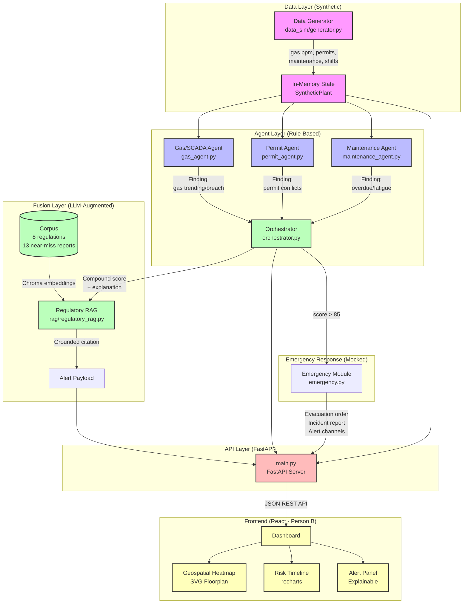
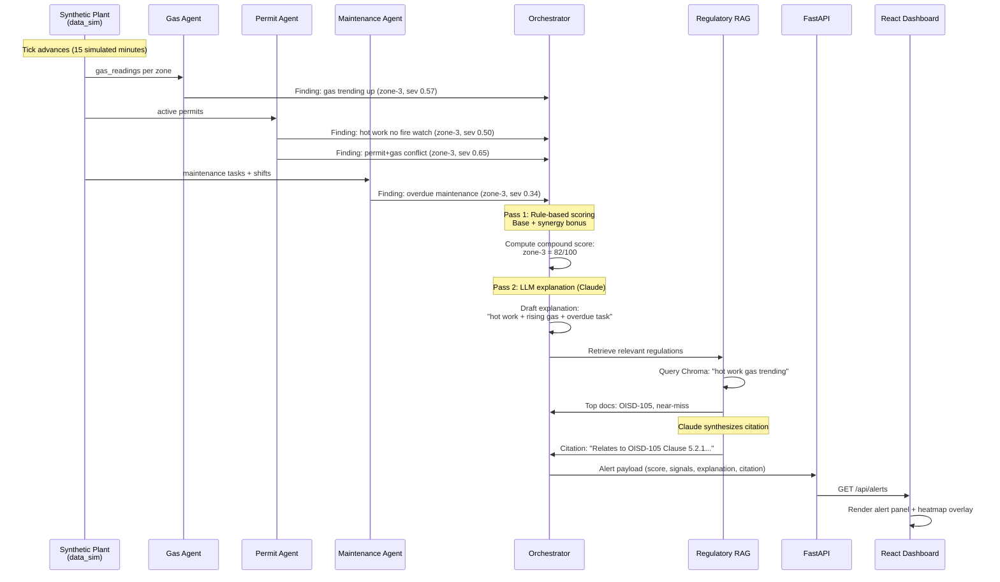

# SentriX - Compound Risk Intelligence Platform
## System Architecture

> **Note:** This is a hackathon prototype (20-day timeline). All data is 100% synthetic.
> The architecture demonstrates the correlation/fusion concept, not production deployment.

---

## High-Level Architecture



---

## Data Flow: From Sensor to Alert



---

## Component Details

### 1. Data Generator (`data_sim/generator.py`)

**Purpose:** Produce deterministic, reproducible synthetic sensor/permit/maintenance streams.

**Key Classes:**
- `SyntheticPlant` — stateful simulation, advances tick-by-tick
- `build_demo_scenario(seed)` — scripted compound-risk timeline

**Outputs per tick:**
- Gas readings (ppm) for 5 zones, with configurable trends
- Permits (hot work, confined space, general maintenance) with fire-watch flag
- Maintenance tasks (due date, completion status)
- Shift rosters (start/end, hours on shift)

**Demo Scenario (Zone-3):**
```
tick 10: hot work permit opens, NO fire watch
tick 12: gas starts trending upward (~7 ppm/tick)
tick 13: compound condition emerges (fusion flags)
tick 18: gas crosses 50 ppm hard threshold (single-sensor alarm)
Lead time: 5 ticks = 75 minutes
```

---

### 2. Domain Agents (Rule-Based, No LLM)

#### Gas/SCADA Agent (`backend/agents/gas_agent.py`)
- Analyzes recent ppm history (last 5–12 ticks)
- Computes trend rate via least-squares slope
- Classifies: `gas_normal` | `gas_trending_up` | `gas_over_threshold`
- Returns severity 0–1, trend rate (ppm/tick), minutes-to-threshold

#### Permit Agent (`backend/agents/permit_agent.py`)
- Flags: hot work without fire watch (sev ~0.5)
- Flags: permit active in zone with rising/breached gas (sev ~0.65–0.9)
- Cites specific `permit_id`s in findings

#### Maintenance Agent (`backend/agents/maintenance_agent.py`)
- Flags: overdue maintenance tasks (severity scales by hours overdue)
- Flags: long consecutive shifts (>12h = fatigue risk, sev ~0.4–0.8)

**All agents return:** `Finding(zone_id, signal_type, severity, description, details)`

---

### 3. Orchestrator / Fusion Agent (`backend/agents/orchestrator.py`)

**Core Innovation:** Fuses individually-benign signals into a compound risk score.

**Pass 1 — Rule-Based Scoring (runs every tick):**
```python
score = base(dominant_signal × 55 + secondary × 15 + tertiary × 6)
      + co_occurrence_bonus(2+ categories → +8, 3+ → +5)
      + synergy_bonus(hot_work_no_fw + gas_trending → +25)
```

**Key Rule:** The +25 synergy bonus for "hot work without fire watch + rising gas"
makes the score spike to 82 **before** gas crosses its own hard threshold (50 ppm).
That gap (5 ticks / 75 min) is the value proposition.

**Pass 2 — LLM Explanation (only for alerting zones, cached):**
- Calls Claude `claude-sonnet-4-6` with structured findings
- System prompt: "You are a safety officer; explain WHY the score is what it is"
- Output: 2–3 sentences, cites permit ID, gas trend, maintenance factor
- Fallback: deterministic template (still specific, still grounded)

**Outputs:**
- Per-zone risk score (0–100)
- Trigger signals (plain-English list)
- Explanation (LLM or fallback)
- Lead-time tracking (compound alert tick vs single-sensor alarm tick)

---

### 4. Regulatory RAG (`backend/rag/`)

**Corpus (`corpus.py`):**
- **8 real regulatory clauses** (OISD STD 105/117, DGMS Regulations, Factory Act 1948, OSH Code 2020)
- **13 synthetic near-miss reports** (hot work + gas, missing fire watch, overdue maintenance, fatigue-risk shifts)
- Total: 21 documents

**Embedding & Retrieval (`regulatory_rag.py`):**
- Chroma vector store (cosine similarity)
- Default embedding: `all-MiniLM-L6-v2` (sentence-transformers)
- Query: orchestrator explanation → top-5 docs retrieved

**Citation Synthesis:**
- Claude `claude-sonnet-4-6` paraphrases retrieved clauses (1–2 sentences)
- Instruction: "ONLY reference retrieved citations; do not invent"
- Fallback: "Related regulation: [citation]. Similar pattern in [near-miss]."

**Output:** `{"clause": str, "source": str, "status": "llm"|"fallback"|"error"}`

---

### 5. API Layer (`backend/main.py`)

**Framework:** FastAPI + uvicorn

**Contract Endpoints:**

| Endpoint | Method | Purpose |
|----------|--------|---------|
| `/api/zones` | GET | 5 plant zones + floorplan coords (0–1000 space) |
| `/api/permits` | GET | Currently active permits |
| `/api/risk-scores` | GET | Current compound score per zone |
| `/api/risk-scores/history?zone_id=&hours=` | GET | Time series (recharts) |
| `/api/alerts?threshold=` | GET | Zones above threshold + explanation + citation |
| `/api/lead-time` | GET | Compound vs single-sensor lead-time metric |
| `/api/simulate/advance` | POST | Step sim 1 tick, return enriched state |
| `/api/simulate/reset` | POST | Reset to tick 0 |
| `/api/emergency/trigger?zone_id=&threshold=` | POST | Draft mocked emergency response |

**Error Handling:**
- All endpoints try/except → return empty `[]` on failure (no unhandled 500s)
- Global exception handler → JSON error responses
- Emergency endpoint: `400` if zone below threshold, `404` if zone not found

**CORS:** Enabled for `localhost:5173` (Vite) and `localhost:3000` (CRA)

---

### 6. Emergency Response (`backend/emergency.py`)

**Trigger:** Manual call or automatic when `risk_score >= 85`

**Payload:**
- `evacuation_instruction` — canned zone-specific text
- `alert_channels` — list of 5 mocked channels (SMS, PA, app, control room, SCADA)
- `incident_report` — auto-drafted preliminary report (3–4 paragraphs, Factory Act / DGMS tone)
  - Classification + timestamp + location + risk score
  - Contributing factors (orchestrator explanation verbatim)
  - Immediate response (evacuation protocol)
  - Regulatory reference (RAG citation)
  - Factory Act Section 87 / DGMS notification statement
- `status` — always `"MOCKED - no real notifications sent"`

**LLM:** Claude `claude-sonnet-4-6` drafts the report; fallback template if unavailable.

---

### 7. Frontend (React Dashboard - Person B's Track)

**Components:**
- **Geospatial Heatmap** — SVG floorplan (0–1000 coords) with live risk zones overlaid
- **Risk Timeline** — recharts line chart, per-zone score history
- **Alert Panel** — explainable alerts with trigger signals, explanation, regulatory citation
- **Permit Overlay** — active permits rendered on the heatmap

**Data Flow:**
- Poll or subscribe to `/api/risk-scores`, `/api/alerts`, `/api/permits`
- `POST /api/simulate/advance` for live demo stepping
- Emergency button triggers `/api/emergency/trigger?zone_id=...`

---

## Technology Stack

### Backend (Track A)
- **Language:** Python 3.11+
- **Framework:** FastAPI 0.115.6 + uvicorn
- **Agent Orchestration:** Hand-rolled state machine (LangGraph available but not used)
- **LLM:** Anthropic Claude API (`claude-sonnet-4-6`)
- **Vector Store:** Chroma 0.5.23 (persistent, local)
- **Embeddings:** `sentence-transformers` (all-MiniLM-L6-v2)
- **State:** In-memory (SQLite/in-memory for history; no DB server)

### Frontend (Track B)
- **Framework:** React + Tailwind CSS
- **Charts:** recharts
- **Floorplan:** SVG (0–1000 normalized space)

### Infrastructure
- **Data:** 100% synthetic (no real plant access)
- **Deployment:** Local dev (hackathon scope; not production-hardened)
- **API Keys:** `ANTHROPIC_API_KEY` (optional; fallback templates provided)

---

## Key Design Decisions

### 1. **Why Synthetic Data?**
No access to real plant SCADA/permit systems. Building a realistic generator lets us
demonstrate the fusion logic without waiting for data partnerships. Explicitly labeled
as synthetic everywhere (code comments, API responses, UI).

### 2. **Why Rule-Based Domain Agents + LLM Orchestrator?**
- Domain agents (gas, permit, maintenance) are **cheap and fast** — pure
  Python/statistics, no LLM calls, run every tick.
- Orchestrator uses the **LLM only for reasoning/explanation** (2–3 sentences per alert),
  not for the scoring itself. This keeps the scoring deterministic, auditable, and
  testable.
- LLM explanations are cached per signal-type signature → cost-efficient even at scale.

### 3. **Why the +25 Synergy Bonus?**
The explicit rule "hot work without fire watch + rising gas → +25" is the core
differentiator. It's tuned so the compound score crosses the alert threshold (60)
**before** any single sensor crosses its own hard threshold. That pre-alarm window
(5 ticks = 75 minutes in the demo) is what proves correlation adds value.

### 4. **Why Chroma for RAG?**
- Lightweight, no server, persists locally
- Good enough for 21 documents (not optimizing for 10M-doc scale)
- Default embeddings work well for technical regulatory text

### 5. **Why Mock the Emergency Response?**
Scope constraint: we have 20 days and no access to real SMS gateways, PA systems, or
incident-management platforms. The **drafted incident report** (Claude-generated,
Factory Act / DGMS compliant) is the real capability; the channel list is a demo prop.

---

## Deployment & Demo Flow

### Local Development
```bash
# Backend (Track A)
uvicorn backend.main:app --reload --port 8000

# Frontend (Track B)
cd frontend && npm run dev  # Vite on :5173 or CRA on :3000
```

### Live Demo Script (On Stage)
1. **Start at tick 0** — show the heatmap, all zones green/yellow (benign)
2. **Advance to tick 10** — hot work permit opens in zone-3, fire watch flag is `false`
   - Heatmap: zone-3 turns orange (~43 score)
   - Alert panel: not alerting yet (below 60 threshold)
3. **Advance to tick 13** — gas starts trending, compound condition emerges
   - **Score jumps to 82** (alert fires)
   - Alert panel: "hot work + rising gas + overdue maintenance"
   - RAG citation: "Relates to OISD STD 105 Clause 5.2.1..."
   - **Headline:** "Flagged 75 minutes before a single-sensor system would have"
4. **Advance to tick 18** — gas crosses 50 ppm (single-sensor alarm would fire now)
   - Score: 100 (critical)
5. **Trigger emergency response** — click button or call API
   - Evacuation order drafted
   - Incident report displayed (Factory Act / DGMS compliance language)
   - Show mocked channel list (SMS, PA, app, control room, SCADA)

### Rehearsal Notes
- Set `ANTHROPIC_API_KEY` for fluent Claude-drafted text
- Without key: deterministic fallback templates (still specific, still grounded)
- Reset button (`POST /api/simulate/reset`) for re-running the scenario

---

## File Structure

```
Evolv_SentriX/
├── data_sim/                    # Synthetic data generator
│   ├── __init__.py
│   ├── generator.py             # SyntheticPlant, build_demo_scenario
│   └── run_sim.py               # Sanity-check runner
│
├── backend/                     # FastAPI backend (Track A)
│   ├── __init__.py
│   ├── main.py                  # API server, endpoints, CORS
│   ├── emergency.py             # Mocked emergency response + incident report
│   │
│   ├── agents/                  # Domain agents + orchestrator
│   │   ├── __init__.py
│   │   ├── base.py              # Finding dataclass, helpers
│   │   ├── gas_agent.py         # Gas/SCADA domain agent
│   │   ├── permit_agent.py      # Permit domain agent
│   │   ├── maintenance_agent.py # Maintenance/shift domain agent
│   │   ├── orchestrator.py      # Fusion agent (rule-based + LLM)
│   │   └── run_agents_test.py   # Tick-by-tick agent test harness
│   │
│   └── rag/                     # Regulatory RAG module
│       ├── __init__.py
│       ├── corpus.py            # 8 regulations + 13 near-miss reports
│       ├── regulatory_rag.py    # Chroma retrieval + Claude synthesis
│       └── chroma_db/           # Chroma persistence (gitignored)
│
├── frontend/                    # React dashboard (Track B)
│   └── (Person B's work)
│
├── requirements.txt             # Python dependencies
├── .gitignore                   # Excludes chroma_db, .env, __pycache__
├── README.md                    # Project overview + synthetic data docs
└── ARCHITECTURE.md              # This file
```

---

## Limitations & Future Work

### Hackathon Scope (What We Built)
✅ Synthetic data generator (deterministic, reproducible)  
✅ Three domain agents (rule-based, no LLM, fast)  
✅ Orchestrator fusion (explicit synergy rules + Claude reasoning)  
✅ Regulatory RAG (21-doc corpus, Chroma, grounded citations)  
✅ FastAPI backend (all contract endpoints live)  
✅ Mocked emergency response (drafted incident reports)  
✅ Lead-time metric (compound vs single-sensor)  

### Out of Scope (Explicitly Not Built)
❌ CCTV / computer-vision (architecture-slide mention only)  
❌ Real SMS/PA/app notification integrations  
❌ Production database (SQLite/in-memory is fine for the demo)  
❌ Real plant data validation (100% synthetic, labeled as such)  
❌ Multi-tenancy, auth, role-based access control  
❌ Scalability tuning (optimized for 5 zones, 30 ticks, single-user demo)  

### If We Had 6 More Months...
1. **Real Data Integration** — ingest live SCADA/DCS feeds via OPC UA or Modbus
2. **CCTV/CV Module** — YOLO/Detectron2 for PPE compliance, fire/smoke detection
3. **Multi-Site** — federated deployment across multiple plants, central monitoring
4. **Incident Workflow** — full lifecycle from alert → investigation → corrective action
5. **Historical Analytics** — trend analysis, root-cause mining, near-miss clustering
6. **Explainability UI** — interactive "why this score?" drilldown (SHAP-style)
7. **Mobile App** — native iOS/Android for field operators
8. **Regulatory Compliance Automation** — auto-file DGMS/Factory Act notifications

---

## Performance Characteristics

### Latency (Synthetic Data, Local Dev, No API Key)
- `POST /api/simulate/advance`: ~15–30 ms (advance tick + fusion + RAG retrieval)
- `GET /api/alerts`: <5 ms (cached explanations)
- `POST /api/emergency/trigger`: ~20 ms (fallback template; +500 ms with Claude)

### Cost (With Claude API)
- **Per tick:** ~2 Claude calls (1 for orchestrator explanation if alerting, 1 for RAG citation)
- **Token count:** ~300–600 tokens/call
- **Est. cost:** ~$0.002–0.005 per alerting tick (Claude Sonnet pricing)
- **Daily cost (100 ticks/day, 20% alerting):** ~$0.10–0.20

### Scale (Hackathon Scope)
- **Zones:** 5 (easily scales to 50–100 with current architecture)
- **Corpus:** 21 docs (Chroma handles 10k+ without issues)
- **History:** In-memory (100 ticks ≈ 2.5 MB state; SQLite for 1M+ ticks)

---

## Security & Compliance Notes

### Data Privacy
- **All data is synthetic** → no real plant data, no PII, no GDPR/CCPA concerns
- Regulatory clauses are public-domain (OISD, DGMS, Factory Act)

### API Security (Production TODO)
- No auth in hackathon prototype (local dev only)
- Production would need: JWT/OAuth, rate limiting, role-based access

### LLM Safety
- System prompts instruct Claude to paraphrase (not quote verbatim) and never invent citations
- RAG retrieval ensures citations are grounded in actual corpus documents
- Fallback templates guarantee deterministic output if LLM fails

### Regulatory Disclaimer
- **This is a demonstration platform, not a certified safety system**
- Real deployment would require: IEC 61508/61511 functional safety certification,
  hazard analysis (HAZOP), third-party audits, regulatory approval (DGMS, Factory Inspectorate)

---

## Credits & References

### Regulatory Sources (Public Domain)
- **OISD STD 105** — Fire Protection Facilities for Petroleum Refineries and Installations
- **OISD STD 117** — Safety in Pipeline Design, Construction, and Operation
- **DGMS (Mines) Regulations 1961** — Gas testing and hot work procedures
- **Factories Act 1948** — Sections 38 (fire precautions), 87 (accident reporting)
- **OSH Code 2020 (India)** — Permit-to-work systems

### Technology Stack
- **FastAPI** — Modern Python web framework
- **Anthropic Claude** — LLM reasoning and text generation
- **Chroma** — Vector database for RAG
- **sentence-transformers** — Embedding models
- **React + Tailwind CSS** — Frontend framework
- **recharts** — Timeline visualization

### Team
- **Track A (Backend):** Synthetic data generator, agents, orchestrator, RAG, API
- **Track B (Frontend):** React dashboard, geospatial heatmap, risk timeline, alert panel

---

## Conclusion

SentriX demonstrates a **correlation/fusion architecture** that flags compound industrial
hazards **before** individual sensors cross their own hard thresholds. The 75-minute
lead time in the demo scenario is achieved through:

1. **Rule-based domain agents** that stay cheap and fast
2. **Explicit synergy rules** in the orchestrator that recognize dangerous combinations
3. **LLM reasoning** that explains *why* the score is what it is, in plain language
4. **Grounded regulatory citations** via RAG, ensuring every alert ties back to OISD/DGMS/Factory Act

The hackathon prototype proves the concept. A production system would add real data
integration, CCTV/CV, multi-site federation, and functional safety certification —
but the core fusion logic (the differentiator) is already here.

---

**Document Version:** 1.0  
**Last Updated:** January 2025  
**Authors:** Track A (Backend) + Track B (Frontend)  
**Status:** Hackathon Prototype (20-day build)
