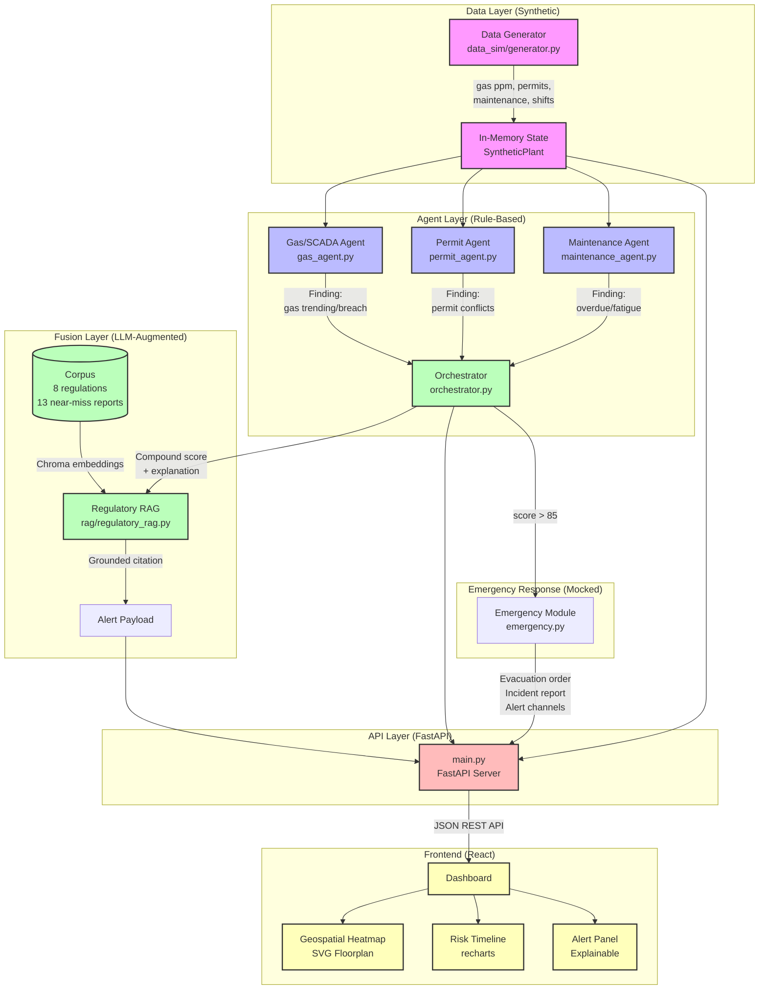

# SentriX - Compound Risk Intelligence Platform
## System Architecture

> **Note:** This is a hackathon prototype (20-day timeline). All data is 100% synthetic.
> The architecture demonstrates the correlation/fusion concept, not production deployment.

---

## High-Level Architecture



---

## Component Details

### 1. Data Generator (`data_sim/generator.py`)

**Purpose:** Produce deterministic, reproducible synthetic sensor/permit/maintenance streams.

**Key Classes:**
- `SyntheticPlant` — stateful simulation, advances tick-by-tick
- `build_demo_scenario(seed)` — scripted compound-risk timeline

**Outputs per tick:**
- Gas readings (ppm) for 5 zones, with configurable trends
- Permits (hot work, confined space, general maintenance) with fire-watch flag
- Maintenance tasks (due date, completion status)
- Shift rosters (start/end, hours on shift)

### 2. Domain Agents (Rule-Based, No LLM)

#### Gas/SCADA Agent (`backend/agents/gas_agent.py`)
- Analyzes recent ppm history (last 5–12 ticks)
- Computes trend rate via least-squares slope
- Classifies: `gas_normal` | `gas_trending_up` | `gas_over_threshold`
- Returns severity 0–1, trend rate (ppm/tick), minutes-to-threshold

#### Permit Agent (`backend/agents/permit_agent.py`)
- Flags: hot work without fire watch (sev ~0.5)
- Flags: permit active in zone with rising/breached gas (sev ~0.65–0.9)
- Cites specific `permit_id`s in findings

#### Maintenance Agent (`backend/agents/maintenance_agent.py`)
- Flags: overdue maintenance tasks (severity scales by hours overdue)
- Flags: long consecutive shifts (>12h = fatigue risk, sev ~0.4–0.8)

**All agents return:** `Finding(zone_id, signal_type, severity, description, details)`

### 3. Orchestrator / Fusion Agent (`backend/agents/orchestrator.py`)

**Core Innovation:** Fuses individually-benign signals into a compound risk score.

**Pass 1 — Rule-Based Scoring (runs every tick):**
```python
score = base(dominant_signal × 55 + secondary × 15 + tertiary × 6)
      + co_occurrence_bonus(2+ categories → +8, 3+ → +5)
      + synergy_bonus(hot_work_no_fw + gas_trending → +25)
```

**Pass 2 — LLM Explanation (only for alerting zones, cached):**
- Calls Claude `claude-sonnet-4-6` with structured findings
- System prompt: "You are a safety officer; explain WHY the score is what it is"
- Output: 2–3 sentences, cites permit ID, gas trend, maintenance factor
- Fallback: deterministic template (still specific, still grounded)

### 4. Regulatory RAG (`backend/rag/`)

**Corpus (`corpus.py`):**
- **8 real regulatory clauses** (OISD STD 105/117, DGMS Regulations, Factory Act 1948, OSH Code 2020)
- **13 synthetic near-miss reports** 
- Total: 21 documents

**Embedding & Retrieval (`regulatory_rag.py`):**
- Chroma vector store (cosine similarity)
- Default embedding: `all-MiniLM-L6-v2` (sentence-transformers)
- Query: orchestrator explanation → top-5 docs retrieved

**Citation Synthesis:**
- Claude `claude-sonnet-4-6` paraphrases retrieved clauses (1–2 sentences)
- Fallback: "Related regulation: [citation]. Similar pattern in [near-miss]."

### 5. API Layer (`backend/main.py`)
- FastAPI + uvicorn framework.
- See `docs/API.md` for full contract endpoint details.

### 6. Emergency Response (`backend/emergency.py`)
- Triggered manually or automatically when `risk_score >= 85`.
- Generates an evacuation instruction, mocked alert channels, and a drafted incident report.

### 7. Frontend (React Dashboard)
- **Geospatial Heatmap** — SVG floorplan with live risk zones overlaid.
- **Risk Timeline** — recharts line chart.
- **Alert Panel** — explainable alerts.
- **Permit Overlay** — active permits on the heatmap.

---

## Technology Stack

### Backend
- **Language:** Python 3.11+
- **Framework:** FastAPI 0.115.6 + uvicorn
- **Agent Orchestration:** Hand-rolled state machine
- **LLM:** Anthropic Claude API (`claude-sonnet-4-6`)
- **Vector Store:** Chroma 0.5.23 (persistent, local)
- **Embeddings:** `sentence-transformers` (all-MiniLM-L6-v2)
- **State:** In-memory

### Frontend
- **Framework:** React + Tailwind CSS
- **Charts:** recharts
- **Floorplan:** SVG (0–1000 normalized space)

---

## File Structure

```
Evolv_SentriX/
├── data_sim/                    # Synthetic data generator
├── backend/                     # FastAPI backend
│   ├── main.py                  # API server, endpoints, CORS
│   ├── emergency.py             # Mocked emergency response
│   ├── agents/                  # Domain agents + orchestrator
│   └── rag/                     # Regulatory RAG module
├── frontend/                    # React dashboard
├── docs/                        # Architecture and design documentation
├── requirements.txt             # Python dependencies
└── .github/workflows/           # CI Pipeline
```

---

## Performance Characteristics

### Latency (Synthetic Data, Local Dev, No API Key)
- `POST /api/simulate/advance`: ~15–30 ms (advance tick + fusion + RAG retrieval)
- `GET /api/alerts`: <5 ms (cached explanations)
- `POST /api/emergency/trigger`: ~20 ms (fallback template; +500 ms with Claude)

### Cost (With Claude API)
- **Per tick:** ~2 Claude calls (1 for orchestrator explanation if alerting, 1 for RAG citation)
- **Est. cost:** ~$0.002–0.005 per alerting tick (Claude Sonnet pricing)

### Scale (Hackathon Scope)
- **Zones:** 5 (easily scales to 50–100 with current architecture)
- **Corpus:** 21 docs (Chroma handles 10k+ without issues)
- **History:** In-memory (100 ticks ≈ 2.5 MB state)

---

## Conclusion
SentriX demonstrates a **correlation/fusion architecture** that flags compound industrial hazards **before** individual sensors cross their own hard thresholds.
