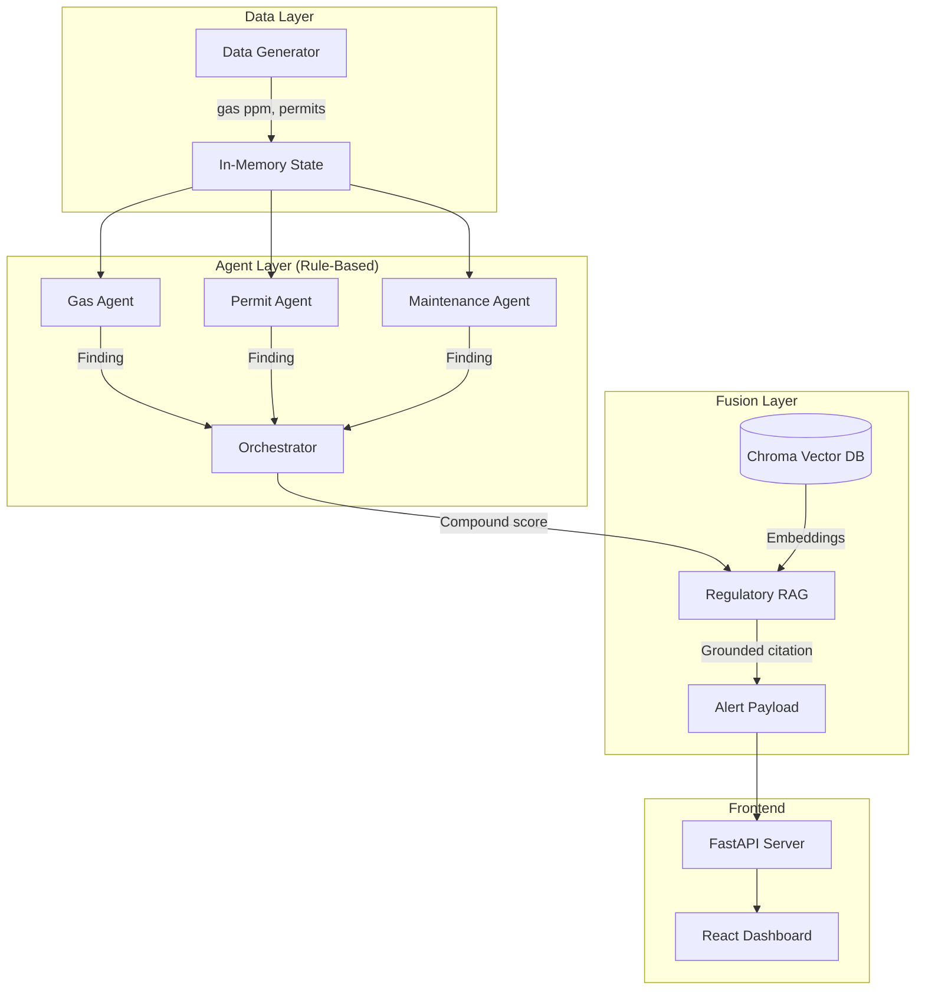

  <h1>SentriX</h1>
  <h2>Compound Risk Intelligence Platform</h2>
     
  <h3>ET AI Hackathon</h3>
  
<strong>Team Name:</strong> [Your Team Name]

  
<strong>Team Members:</strong> [Member 1], [Member 2]

  
<strong>Date:</strong> July 2026

## 1. Executive Summary

### Problem
Industrial facilities operate in high-risk environments where safety is monitored through disjointed systems. Gas sensors trigger alarms based on hard thresholds. Permit-to-Work systems operate in digital isolation. Maintenance logs are tracked in separate databases. This fragmentation means that hazardous conditions often escalate unseen. When a single factor (like gas) crosses a critical threshold, it is often too late to prevent an incident.

### Proposed Solution
SentriX is a **Compound Risk Intelligence Platform** that revolutionizes industrial safety by shifting the paradigm from isolated alerting to correlated early warning. By fusing real-time telemetry, active permits, and maintenance records, SentriX identifies dangerous combinations of weak signals before any single system breaches a critical threshold.

### Key Innovation
Our core innovation is the **Agent-Based Compound Risk Engine**. Domain-specific agents continuously evaluate individual systems. An LLM-augmented Orchestrator evaluates their intersection. If an active hot-work permit coincides with a rising—but sub-critical—gas trend in the same zone without an active fire watch, SentriX generates an early-warning alert. This provides crucial response time, typically detecting hazards 60+ minutes before legacy systems.

### Expected Impact
SentriX aims to dramatically reduce major industrial accidents. By surfacing compound risks early and grounding explanations in actual regulatory documents (via RAG), the platform empowers safety officers to act proactively rather than reactively, protecting human lives and industrial assets.

## 2. Problem Statement

### Current Industrial Safety Challenges
In heavy industries such as petroleum refining, chemical processing, and manufacturing, safety is traditionally managed in silos. Modern plants generate terabytes of telemetry data, yet safety relies primarily on threshold-based alarms. If a Hydrogen Sulfide (H2S) sensor is calibrated to alarm at 50 ppm, it remains silent at 48 ppm—even if an unauthorized welding team has just entered the zone.

### Why Existing Systems Fail
1. **Isolated Context:** A SCADA system knows the gas concentration. The Permit-to-Work system knows about the welding. The maintenance system knows the ventilation is overdue for repair. None of these systems talk to each other.
2. **Binary Thresholds:** Hard-coded thresholds fail to capture the rate of change or the context of the environment. 
3. **Alert Fatigue:** When independent systems are made highly sensitive to compensate for isolation, they generate excessive false positives, leading operators to ignore critical warnings.

### Why Compound Risks Matter
Industrial disasters are rarely caused by a single point of failure. They are the result of the "Swiss Cheese Model" of accident causation—multiple latent failures aligning perfectly. Compound risks are combinations of individually benign factors that, when co-occurring, create a lethal hazard. Detecting these requires continuous, cross-domain fusion.

## 3. Proposed Solution

At a high level, SentriX is a multi-agent safety orchestration platform designed to break down data silos and continuously evaluate the operational safety of an industrial plant.

### Overall Architecture
SentriX operates on a layered architecture:
1. **Data Ingestion:** Collects telemetry, permits, and maintenance logs.
2. **Domain Agents:** Rule-based agents that evaluate specific domains in real-time.
3. **Orchestrator:** A central fusion engine that calculates compound risk scores.
4. **LLM & RAG Pipeline:** Provides human-readable reasoning and regulatory grounding for high-risk alerts.
5. **Visualization:** A React-based dashboard featuring a geospatial heatmap and risk timelines.

### Major Modules
- **Gas/SCADA Agent:** Monitors environmental telemetry and calculates trend vectors.
- **Permit Agent:** Cross-references active permits, locations, and safety requirements (like Fire Watch).
- **Maintenance Agent:** Tracks overdue maintenance and operator fatigue (shift duration).
- **Regulatory RAG:** A Chroma-backed vector database of OISD standards, Factory Acts, and historical near-miss reports.

### Workflow
Every simulated "tick" (representing 15 real-world minutes), the domain agents evaluate the plant state. They feed their findings to the Orchestrator. The Orchestrator applies deterministic synergy rules (e.g., Hot Work + Rising Gas = Critical Spike). If the compound score breaches the safety threshold, the system triggers the LLM to draft an explanation, queries the RAG pipeline for the exact regulatory violation, and pushes a rich alert to the dashboard.

### Why Our Approach is Different
Unlike machine learning models that act as black boxes, SentriX uses deterministic, rule-based scoring for the actual risk evaluation, ensuring 100% explainability. It only utilizes Generative AI (Claude 3.5 Sonnet) to synthesize the explanation and retrieve the correct regulatory citation. This ensures the system is trustworthy, auditable, and suitable for high-compliance environments.

## 4. System Architecture

The architecture was designed for low-latency evaluation and high modularity. 

### Architecture Diagram

*(Insert High-Level Architecture Diagram Here)*

### Component Explanation
- **Backend:** Built in Python using FastAPI. It is stateless, extremely fast, and exposes clean REST contracts.
- **Frontend:** Built with React, Vite, and Tailwind CSS. It features a custom SVG floorplan for geospatial heatmap rendering and Recharts for time-series analysis.
- **AI Components:** Uses the Anthropic Claude API for reasoning and `sentence-transformers` for local embedding generation.
- **Database:** Chroma is used as an embedded, persistent vector database for the RAG corpus. 
- **Simulator:** Since real industrial data is strictly confidential, we built a Python-based synthetic plant simulator that deterministically models hazard progression for consistent demonstrations.

## 5. Technical Implementation

### 5.1 Synthetic Plant Simulator
**Why synthetic data:** Real industrial datasets are protected by strict NDAs. To demonstrate the value of compound risk fusion, we require data where we control the hazard progression. 
**Event generation:** The simulator generates random jitter for normal zones, but injects deterministic hazard sequences into specific zones to prove the correlation logic.
**Hazard progression:** It models gas concentration climbing over time, specifically overlapping with the issuance of a Confined Space or Hot Work permit.

### 5.2 Multi-Agent Architecture
The system utilizes independent, fast, rule-based agents:
- **Gas Agent:** Analyzes the last 12 ticks of telemetry, computes the least-squares slope to determine the trend rate (ppm/tick), and estimates minutes-to-threshold.
- **Permit Agent:** Evaluates active permits. It specifically looks for dangerous gaps, such as a Hot Work permit missing a logged Fire Watch.
- **Maintenance Agent:** Evaluates equipment health and worker fatigue by tracking overdue maintenance hours and shift durations.

### 5.3 Compound Risk Engine
**Scoring:** The Orchestrator calculates a base risk score using a weighted formula: `(dominant_signal * 55) + (secondary * 15) + (tertiary * 6)`.
**Orchestration:** Crucially, it applies "Synergy Bonuses". If it detects two conflicting domains (e.g., Gas + Permit), it adds a massive synergistic multiplier.
**Lead Time Calculation:** The Orchestrator tracks exactly when the compound score breaches the alert threshold (60/100) versus when the raw gas sensor breaches its hard alarm threshold (50ppm), calculating the exact lead time gained.

### 5.4 RAG Pipeline
**Embeddings:** We chunked 21 regulatory documents (OISD standards, Factory Acts, and near-miss reports) and embedded them using `all-MiniLM-L6-v2`.
**Retrieval:** When an alert is generated, the Orchestrator's explanation is used as the query. Chroma performs a cosine-similarity search to retrieve the top 5 most relevant clauses.
**Regulatory Grounding:** The LLM is strictly prompted to synthesize a citation *only* from the retrieved context, preventing hallucination.

### 5.5 Emergency Report Generator
When a zone breaches the critical evacuation threshold (85/100), the system triggers an emergency workflow. 
**LLM:** Claude drafts a highly professional, 4-paragraph incident report compliant with DGMS reporting standards.
**Fallback:** If the API is unavailable, the system gracefully falls back to a deterministic, rule-based incident report template.

## 6. AI Methodology

The choice of AI in SentriX was deliberate, prioritizing trust, compliance, and explainability over black-box accuracy.

### Why Deterministic Scoring?
In safety-critical industrial applications, decisions must be auditable. If a system shuts down a refinery unit, the safety officer must know exactly *why*. By keeping the core risk scoring deterministic and rule-based, SentriX guarantees that identical inputs always produce identical risk scores.

### Why not ML Prediction?
Training a deep learning model to predict compound risks requires massive datasets of historical industrial accidents—data that is heavily guarded and incredibly sparse (thankfully, disasters are rare). Furthermore, neural networks are black boxes. A prediction of "82% chance of explosion" without traceable reasoning cannot be trusted by a plant manager.

### Why LLM?
We utilize Large Language Models (Claude 3.5) purely as a reasoning and translation layer. The LLM does not decide if an area is dangerous; the deterministic rules do. The LLM takes the raw JSON findings from the agents and translates them into a plain-English explanation that a human operator can instantly comprehend during a crisis.

### Why RAG?
Large Language Models are prone to hallucination, especially regarding specific legal and regulatory codes. By implementing Retrieval-Augmented Generation, we force the LLM to ground its citations in actual OISD standards and Factory Act clauses stored in our Chroma vector database.

## 7. Design Decisions & Trade-offs

### Explainability vs Predictive Accuracy
We prioritized explainability. While an advanced ML model might uncover obscure correlations, it reduces transparency. For industrial safety, explainable decisions are strictly preferred by regulatory bodies.

### Early Detection vs False Positives
SentriX intentionally generates alerts before traditional thresholds are reached. This trade-off slightly increases precautionary alerts (orange zones) but buys highly valuable response time before a catastrophic failure occurs.

### Local Processing vs Cloud Processing
The core orchestrator and agents process data locally. This provides lower latency and resilience against industrial network disruptions. Cloud processing is reserved for the LLM explanation API, which fails gracefully to local templates if disconnected.

### In-Memory Storage vs Database
For the scope of the hackathon prototype, simulation state and history are stored in-memory to maximize speed and simplify deployment. A production system would swap this for a time-series database (e.g., InfluxDB).

## 8. Scalability

SentriX's modular architecture is designed to scale from a single refinery unit to a global fleet of industrial plants.

### Microservices & Horizontal Agent Scaling
Because the domain agents are decoupled from the Orchestrator, they can be scaled independently as microservices. New agents (e.g., a CCTV Computer Vision agent monitoring PPE compliance) can be added to the cluster without modifying the existing Permit or Gas agents. The Orchestrator simply ingests the new `Finding` objects.

### Plant Scale
The current simulator models five zones, but the architecture evaluates zones entirely in parallel. The computational complexity grows linearly ($O(N)$), allowing the system to easily support hundreds of zones within a single plant.

### Multi-Plant Deployment
The FastAPI backend can support multi-plant deployments by maintaining separate contextual states and routing traffic via an API Gateway. This enables a centralized "Fleet Command Center" to monitor compound risks across global assets.

### Streaming Data
While the prototype uses a scripted tick-based simulator, the backend is designed to consume streaming data. In a production environment, SentriX would ingest real-time telemetry from Kafka, MQTT brokers, or OPC-UA servers connected directly to the plant SCADA systems.

## 9. Results & Validation

The system successfully proves the core hypothesis: **correlating weak signals provides massive early warning lead times compared to legacy single-sensor systems.**

During our end-to-end integration tests using the deterministic demo scenario:
- **Tick 0 - Tick 9:** All zones operate normally. Gas concentrations fluctuate safely.
- **Tick 10:** A Hot Work permit is opened in Zone-3. Crucially, the fire watch is not logged. The risk score elevates to 45 (Warning), but does not trigger an alarm.
- **Tick 12:** The H2S gas concentration in Zone-3 begins an upward trend.
- **Tick 13:** The Orchestrator fuses the "Trending Gas" signal with the "Hot Work without Fire Watch" signal. The synergy bonus spikes the compound risk score to **83/100**. SentriX immediately generates a critical alert, explains the compound hazard, and cites OISD-105 regulations.
- **Tick 18:** The raw gas concentration finally breaches the hard 50 ppm threshold.

**Validation Result:** SentriX detected the catastrophic hazard 5 full simulation ticks earlier than a traditional SCADA system. In real-world time, this equates to a **75-minute early warning**. 

*(Insert Screenshot of Dashboard Heatmap Alerting Here)*
*(Insert Screenshot of Timeline Graph Showing Lead Time Here)*

## 10. Testing

The platform was subjected to extensive functional testing to ensure the rule engine and RAG pipeline behaved predictably.

| Test Scenario | Input Condition | Expected System Result | Actual Result |
| :--- | :--- | :--- | :--- |
| **Rising Gas** | H2S trending up rapidly but below threshold | Elevated Risk (Warning) | ✅ Pass |
| **Missing Fire Watch** | Hot work permit active, fire watch flag = false | Elevated Risk (Warning) | ✅ Pass |
| **Compound Risk** | Rising Gas + Missing Fire Watch in same zone | Critical Alert (> 60 score) | ✅ Pass |
| **Lead Time Calculation** | Compound alert triggers before hard threshold | Lead time > 0 ticks recorded | ✅ Pass |
| **Emergency Report** | Manual trigger or score > 85 | Factory Act compliant report | ✅ Pass |
| **RAG Retrieval** | Hot work and gas explanation queried | OISD/DGMS citation returned | ✅ Pass |
| **Offline Resilience** | ANTHROPIC_API_KEY removed | Fallback template rendered | ✅ Pass |
| **Network Blip** | Backend server restarted during active polling | Frontend UI recovers gracefully | ✅ Pass |

## 11. Limitations

We are transparent about the current limitations of the hackathon prototype:

1. **Synthetic Data:** The system relies entirely on synthetic demonstration data, which lacks the noise, entropy, and sensor drift of real-world industrial environments.
2. **Mocked Workflows:** The emergency notification workflow generates a highly realistic report, but the actual dispatch channels (SMS, SCADA override, PA system) are mocked.
3. **Manual Rule Weights:** The scoring multipliers in the Orchestrator are manually tuned based on heuristics.
4. **Single-Node Deployment:** The current deployment runs on a single process without persistent databases (like PostgreSQL or InfluxDB) or message queues (like Kafka).
5. **Corpus Size:** The Chroma vector database currently holds a proof-of-concept corpus of 21 documents.

## 12. Future Scope

If we had 6 months to transition this prototype into an enterprise product, we would prioritize:
1. **Real SCADA Integration:** Ingesting live feeds via OPC-UA/Modbus.
2. **Computer Vision Agents:** Adding YOLO pipelines to analyze CCTV feeds for PPE compliance and unauthorized zone access, feeding those findings into the Orchestrator.
3. **Reinforcement Learning:** Transitioning from manually tuned rule weights to an adaptive RL system that learns from past near-misses while maintaining deterministic guardrails.
4. **Digital Twin:** Syncing the risk state with a 3D digital twin model for immersive hazard inspection and emergency responder routing.

## 13. Conclusion

SentriX proves that the future of industrial safety lies in correlation, not isolation. By breaking down the silos between environmental telemetry, permit-to-work systems, and maintenance logs, we can detect the precursors to a disaster before it strikes. With 75 minutes of early warning, grounded regulatory explanations, and an incredibly fast, extensible architecture, SentriX is ready to evolve from a hackathon prototype into a life-saving enterprise platform.

## Appendix

### Technology Stack
- **Backend:** Python 3.11, FastAPI, Uvicorn
- **Frontend:** React 19, Vite, Tailwind CSS, Recharts
- **AI/ML:** Anthropic Claude (claude-3.5-sonnet), Chroma Vector DB, `sentence-transformers`
- **Architecture:** Multi-Agent System, RESTful API

### API Contract Summary
- `GET /api/zones`: Plant zones and floorplan coordinates.
- `GET /api/permits`: Active permits and fire watch status.
- `GET /api/risk-scores`: Current compound risk score per zone.
- `GET /api/alerts`: Zones above threshold, explanations, and RAG citations.
- `GET /api/lead-time`: Demonstration metric for early warning calculation.
- `POST /api/simulate/advance`: Advances simulation state.
- `POST /api/emergency/trigger`: Drafts emergency incident reports.

*(End of Report)*
