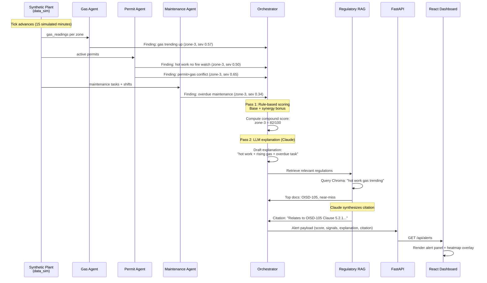

# SentriX - Data Flow & Demo Workflow

## Data Flow: From Sensor to Alert



---

## Deployment & Demo Flow

### Local Development
```bash
# Backend
uvicorn backend.main:app --reload --port 8000

# Frontend
cd frontend && npm run dev
```

### Live Demo Script (On Stage)

**Demo Scenario (Zone-3 Focus):**
1. **Start at tick 0** — show the heatmap, all zones green/yellow (benign).
2. **Advance to tick 10** — hot work permit opens in zone-3, fire watch flag is `false`.
   - Heatmap: zone-3 turns orange (~43 score).
   - Alert panel: not alerting yet (below 60 threshold).
3. **Advance to tick 12** — gas starts trending upward (~7 ppm/tick).
4. **Advance to tick 13** — compound condition emerges (fusion flags).
   - **Score jumps to 82** (alert fires).
   - Alert panel: "hot work + rising gas + overdue maintenance".
   - RAG citation: "Relates to OISD STD 105 Clause 5.2.1...".
   - **Headline:** "Flagged 75 minutes before a single-sensor system would have".
5. **Advance to tick 18** — gas crosses 50 ppm (single-sensor alarm would normally fire now).
   - Score: 100 (critical).
6. **Trigger emergency response** — click button or call API.
   - Evacuation order drafted.
   - Incident report displayed (Factory Act / DGMS compliance language).
   - Show mocked channel list.

### Rehearsal Notes
- Set `ANTHROPIC_API_KEY` for fluent Claude-drafted text.
- Without key: deterministic fallback templates are used (still specific, still grounded).
- Use the Reset button (`POST /api/simulate/reset`) for quickly re-running the scenario.
